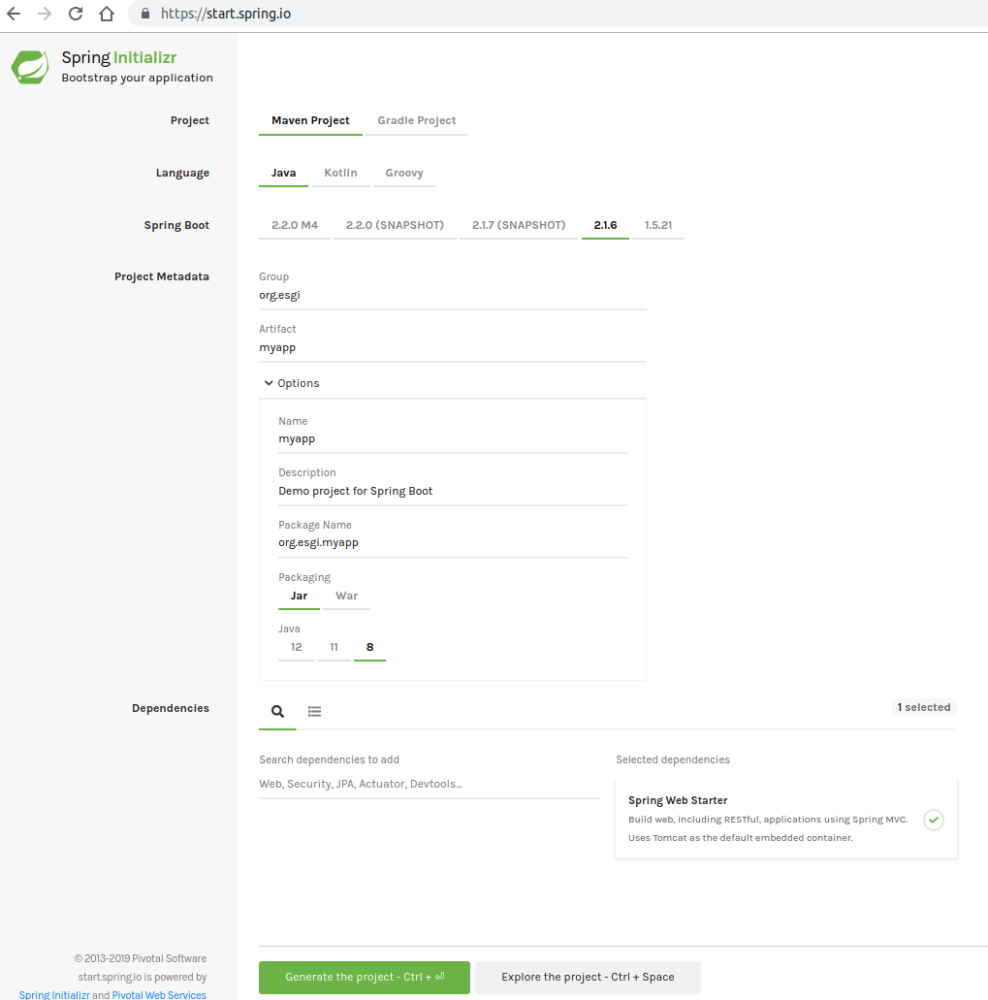

# TP Spring Boot

Ce projet est un TP étape par étape permettant de découvrir Spring Boot.

## Pré-requis

- Maven 3.x
- JDK 8+
- Intellij

## Déroulement

Il n'est pas nécessaire de cloner le projet, la description des étapes doit permettre de réaliser l'application étape par étape.

Néanmoins un correctif est disponible pour chaque étape dans une branche git dédiée.

## Etapes


### Etape 1 - Spring Boot avec le client Spring

#### Mise en place du client Spring

- Télécharger le client Spring

```
wget https://start.spring.io/spring.zip
unzip spring.zip
```

 - Mettre à jour le PATH en rajoutant le répertoire bin de Spring

```
# version linux
PATH=$PWD/spring-2.1.6.RELEASE/bin:$PATH
```
- Vérifier la bonne installation du client Spring

```
spring --version
```

#### Creation d'un 1er controleur en Groovy

- Créer le fichier app.groovy
```
vi app.groovy
```

- Rajouter le code suivant :
```
@RestController
class DemoController {

    @RequestMapping("/")
    String demo() {
        "Voilà ma 1ere application Spring Boot"
    }
}
```

- Exécuter l'application

```
spring run app.groovy
```

Remarque : si le port 8080 est déjà pris, modifier le port :

```
spring run app.groovy -- --server.port=9000

```

- Vérifier que l'application est disponible à l'url http://localhost:8080


### Etape 2 : Un 1er projet Spring Boot en Java

#### Mise en place du squelette de projet

- Aller sur le site https://start.spring.io et générer un squelette de projet Maven, avec un packaging JAR, et la dépendance Spring Web Starter :



- Décompresser le zip et créer un nouveau projet sous Intellij à partir de ce squelette

- Regarder la classe principale MyAppApplication. Examiner le code source de l'annotation @SpringBootApplication. Elle regroupe les annotations :
    - @SpringBootConfiguration
    - @EnableAutoConfiguration
    - @ComponentScan

#### Creation du Controller

- Recoder en java l'exemple fait précédemment en Groovy, en créant une classe DemoController


- Lancer l'application :
    - soit en exécutant le main via Intellij
    - soit avec la commande Maven :
    ```
    mvn spring-boot:run
    ```

Pour information nous avons spécifié un Packaging Jar avec la dépendance Spring Web Starter, l'application contient donc un conteneur de servlet embarqué (Tomcat)


#### Utilisation de Spring Expression Language

- Rajouter une variable name dans la classe DemoController, et afficher dans la réponse du Controller cette variable

Utiliser l'annotation @Value et déclarer cette propriété dans l'application.properties
TODO : A REFORMULER!!!

```
@Value("${person.name:ESGI}")
```


TODO : Ceci correspond à une SPEL (Spring Expression Language)

### Etape 3 : Mise en place d'un 1er test d'intégration

- Créer un test d'intégration
    - utilisation de @SpringBootTest pour charger le contexte et pour définir un port random
    - utilisation de SPEL pour récupérer le port random
    - utilisation de RestTemplate pour avoir un client de notre application

    TODO à compléter avec un exemple


### Etape 4 : Mise en place de JPA

- Aller dans le pom.xml et rajouter le starter spring-boot-starter-data-jpa 
```
                <dependency>
                    <groupId>org.springframework.boot</groupId>
                    <artifactId>spring-boot-start-data-jpa<artifactId>
                </dependency>
```        

- Rajouter la dépendance à la base de données h2 
```        
		<dependency>
			<groupId>com.h2database</groupId>
			<artifactId>h2</artifactId>
			<scope>runtime</scope>
		</dependency>
```        

=> Pas besoin de spécifier la version 

=> Le scope est runtime

=> Le starter JPA ne propose pas de base de données par défaut


==============================================

TODO A COMPLETER AVEC LES TESTS ET CIE....

==============================================

### Etape 5 : Mise en place Spring Security

- Ajouter le starter spring-boot-starter-security dans le pom.xml

- Vérifier que l'application est à présent "sécurisée" en la lançant : http://localhost:8080

- se connecter avec le compte 'user' et le mot de passe correspondant (affiché dans les logs). Ce comportement n'est pas satisfaisant. Spring Boot ne fait pas de choix par défaut pour nous, il nous faut avoir une "opinion"


- Rajouter la config avec une authentification en mémoire

TODO

voir https://www.mkyong.com/spring-boot/spring-security-there-is-no-passwordencoder-mapped-for-the-id-null/ 

- Vérifier les tests...

  remplacer RestTemplate par la classe utilitaire RestTestTemplate qui permet de spécifier un user et un mot de passe


- Sécuriser une méthode (le point d'entrée) le rôle HERO

- rajouter l'annotation @Secured avec le rôle HERO sur cette méthode
    - Attention : si vous avez créé le user avec .roles("HERO"), le nom du rôle est ROLE_HERO (ROLE_ est automatiquement rajouté)


- Dans la classe principale de l'application, activer cette sécurisation avec l'annotation Spring Security suivante :
```
@EnableGlobalMethodSecurity(securedEnabled = true)
```
 - verifier que le point d'entrée est accessible avec l'utilsateur hero

 - relancer le test d'intégration, corriger le 

### Etape 6 : Mise en place d'Actuator


- Ajouter le starter actuator dans le pom.xml

- relancer l'application et essayer d'atteindre le endpoint http://localhost:8080/env. Cet endpoint n'est accessible que pour le rôle ADMIN

- il faut à présent ajouter le rôle ADMIN à l'un de nos users (par exemple hero)


voir https://www.baeldung.com/spring-boot-actuators

http://localhost:8080/actuator/health
http://localhost:8080/actuator/env
http://localhost:8080/actuator/beans
#management.endpoints.enabled-by-default=true
```
management.endpoints.web.exposure.include=*

```


